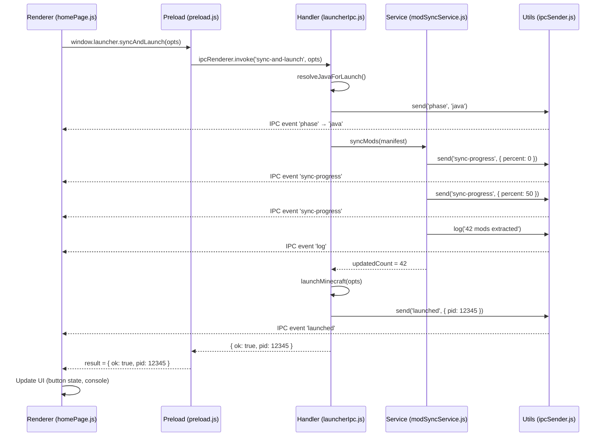

## Overview

Electron applications use **IPC (Inter-Process Communication)** to enable the renderer process (UI) to communicate with the main process (backend). Umucraft Launcher implements a secure IPC bridge via the preload script.

## Security Model

The launcher follows Electron security best practices:

```javascript
// src/main/windows/mainWindow.js
webPreferences: {
  nodeIntegration: false,     // Renderer cannot use require() or Node.js APIs
  contextIsolation: true,     // Preload runs in isolated context
  preload: path.join(__dirname, '../preload.js'),
}
```

This means:

- **Renderer process** has no direct access to Node.js, file system, or Electron APIs
- **Preload script** runs before renderer and exposes only specific APIs via `contextBridge`
- **Main process** handles all system operations (file I/O, spawning processes, etc.)

## Preload Bridge

**File**: `src/main/preload.js`

The preload script exposes a safe API to the renderer via `window.launcher`:

```javascript
const { contextBridge, ipcRenderer } = require('electron');

contextBridge.exposeInMainWorld('launcher', {
  // Window controls
  minimize: () => ipcRenderer.invoke('window-minimize'),
  maximize: () => ipcRenderer.invoke('window-maximize'),
  close: () => ipcRenderer.invoke('window-close'),

  // Startup
  startupCheck: () => ipcRenderer.invoke('startup-check'),

  // Config
  loadConfig: () => ipcRenderer.invoke('load-config'),
  saveConfig: (config) => ipcRenderer.invoke('save-config', config),

  // Launcher actions
  fetchManifest: () => ipcRenderer.invoke('fetch-manifest'),
  syncAndLaunch: (opts) => ipcRenderer.invoke('sync-and-launch', opts),

  // Server ping
  pingServer: (opts) => ipcRenderer.invoke('ping-server', opts),

  // Utilities
  openFolder: (p) => ipcRenderer.invoke('open-folder', p),
  openExternal: (url) => ipcRenderer.invoke('open-external', url),
  browseMinecraftDir: () => ipcRenderer.invoke('browse-minecraft-dir'),
  getSystemInfo: () => ipcRenderer.invoke('get-system-info'),

  // Events from main process
  on: (event, cb) => {
    const wrapped = (_, ...args) => cb(...args);
    ipcRenderer.on(event, wrapped);
    return () => ipcRenderer.removeListener(event, wrapped);
  },
  once: (event, cb) => {
    ipcRenderer.once(event, (_, ...args) => cb(...args));
  },
});
```

## IPC Methods

The launcher exposes 15 IPC methods to the renderer:

### Window Controls

| Method | Handler | Purpose |
|--------|---------|--------|
| `window.launcher.minimize()` | `window-minimize` | Minimize window |
| `window.launcher.maximize()` | `window-maximize` | Toggle maximize/restore |
| `window.launcher.close()` | `window-close` | Quit application |

**Handler**: `src/main/ipc/windowIpc.js`

```javascript
ipcMain.handle('window-minimize', () => state.mainWindow.minimize());
ipcMain.handle('window-maximize', () => {
  state.mainWindow.isMaximized() 
    ? state.mainWindow.unmaximize() 
    : state.mainWindow.maximize();
});
ipcMain.handle('window-close', () => app.quit());
```

### Config Management

| Method | Handler | Purpose |
|--------|---------|--------|
| `window.launcher.loadConfig()` | `load-config` | Load config.json |
| `window.launcher.saveConfig(config)` | `save-config` | Save config.json |

**Handler**: `src/main/ipc/configIpc.js`

```javascript
ipcMain.handle('load-config', () => {
  const configPath = path.join(BASE_DIR, 'config.json');
  if (fs.existsSync(configPath)) {
    return JSON.parse(fs.readFileSync(configPath, 'utf8'));
  }
  return { username: '', ram: 4096, selectedProfile: 'Default', minecraftDir: BASE_DIR };
});

ipcMain.handle('save-config', (_, config) => {
  fs.writeFileSync(
    path.join(BASE_DIR, 'config.json'),
    JSON.stringify(config, null, 2)
  );
  return true;
});
```

**Usage in renderer**:

```javascript
// Load config on startup
const config = await window.launcher.loadConfig();

// Save config when user clicks "Save"
await window.launcher.saveConfig({
  username: 'Player123',
  ram: 8192,
  selectedProfile: 'Default',
  minecraftDir: '/home/user/.UmuCraft',
});
```

### Launcher Actions

| Method | Handler | Purpose |
|--------|---------|--------|
| `window.launcher.startupCheck()` | `startup-check` | Check if Java is ready |
| `window.launcher.fetchManifest()` | `fetch-manifest` | Fetch server manifest |
| `window.launcher.syncAndLaunch(opts)` | `sync-and-launch` | Sync mods + launch Minecraft |

**Handler**: `src/main/ipc/launcherIpc.js`

#### startup-check

```javascript
ipcMain.handle('startup-check', async () => {
  return {
    javaPath: state.resolvedJavaPath,
    ok: !!state.resolvedJavaPath,
  };
});
```

#### fetch-manifest

```javascript
ipcMain.handle('fetch-manifest', async () => {
  try {
    const manifest = await fetchManifest();
    // Cache for offline use
    fs.writeFileSync(
      path.join(BASE_DIR, 'cache', 'manifest.json'),
      JSON.stringify(manifest, null, 2)
    );
    return { ok: true, manifest };
  } catch (err) {
    // Fallback to cached manifest
    const cachePath = path.join(BASE_DIR, 'cache', 'manifest.json');
    if (fs.existsSync(cachePath)) {
      return { ok: true, manifest: JSON.parse(fs.readFileSync(cachePath, 'utf8')), cached: true };
    }
    return { ok: false, error: err.message };
  }
});
```

**Usage**:

```javascript
const result = await window.launcher.fetchManifest();
if (result.ok) {
  appState.manifest = result.manifest;
  if (result.cached) {
    console.log('Using cached manifest (offline)');
  }
}
```

#### sync-and-launch

```javascript
ipcMain.handle('sync-and-launch', async (_, { config, manifest }) => {
  try {
    const profileName = config.selectedProfile || CONFIG.DEFAULT_PROFILE;
    const profileManifest = manifest.profiles?.[profileName] || manifest;
    
    const mcVersion = profileManifest.minecraftVersion || LATEST_MC_VERSION;
    const forgeVersion = profileManifest.forgeVersion || null;
    const javaInfo = getRequiredJavaVersion(mcVersion);
    const minecraftDir = config.minecraftDir || BASE_DIR;
    
    // 1. Resolve Java
    send('status', `Checking Java ${javaInfo.major}...`);
    send('phase', 'java');
    const javaPath = resolveJavaForLaunch(javaInfo.major);
    
    // 2. Install Forge if needed
    if (forgeVersion) {
      send('status', `Checking Forge ${forgeVersion}...`);
      send('phase', 'forge');
      await installForge(javaPath, minecraftDir, mcVersion, forgeVersion);
    }
    
    // 3. Sync mods
    send('status', 'Syncing mods...');
    send('phase', 'mods');
    const updatedCount = await syncMods(profileManifest, minecraftDir);
    
    if (updatedCount > 0) {
      log(`${updatedCount} mod(s) updated.`);
    } else {
      log('All mods up to date!');
    }
    
    // 4. Launch Minecraft
    send('status', 'Starting Minecraft...');
    send('phase', 'launch');
    const pid = await launchMinecraft({
      javaPath,
      minecraftDir,
      ram: config.ram || 4096,
      username: config.username || 'Player',
      mcVersion,
      forgeVersion,
    });
    
    send('launched', { pid });
    return { ok: true, pid };
  } catch (err) {
    log(`ERROR: ${err.message}`);
    return { ok: false, error: err.message };
  }
});
```

**Usage**:

```javascript
const result = await window.launcher.syncAndLaunch({
  config: appState.config,
  manifest: appState.manifest,
});

if (result.ok) {
  console.log('Minecraft launched! PID:', result.pid);
} else {
  console.error('Launch failed:', result.error);
}
```

### Server Ping

| Method | Handler | Purpose |
|--------|---------|--------|
| `window.launcher.pingServer({ host, port })` | `ping-server` | Ping Minecraft server |

**Handler**: `src/main/ipc/serverIpc.js`

```javascript
ipcMain.handle('ping-server', async (_, { host, port }) => {
  return pingMinecraftServer(host, port || 25565);
});
```

**Usage**:

```javascript
const result = await window.launcher.pingServer({ 
  host: 'mc.umucraft.com', 
  port: 25565 
});

if (result.online) {
  console.log(`Players: ${result.players.online}/${result.players.max}`);
  console.log(`Version: ${result.version.name}`);
} else {
  console.log('Server offline');
}
```

### Utilities

| Method | Handler | Purpose |
|--------|---------|--------|
| `window.launcher.openFolder(path)` | `open-folder` | Open folder in file explorer |
| `window.launcher.openExternal(url)` | `open-external` | Open URL in browser |
| `window.launcher.browseMinecraftDir()` | `browse-minecraft-dir` | Show folder picker dialog |
| `window.launcher.getSystemInfo()` | `get-system-info` | Get platform, RAM, launcher dir |

**Handler**: `src/main/ipc/utilIpc.js`

```javascript
ipcMain.handle('open-folder', (_, folderPath) => {
  shell.openPath(folderPath || BASE_DIR);
});

ipcMain.handle('open-external', (_, url) => {
  if (url && url.startsWith('http')) {
    shell.openExternal(url);
  }
});

ipcMain.handle('browse-minecraft-dir', async () => {
  const result = await dialog.showOpenDialog(state.mainWindow, {
    properties: ['openDirectory'],
    title: 'Select UmuCraft folder',
    defaultPath: BASE_DIR,
  });
  return result.canceled ? null : result.filePaths[0];
});

ipcMain.handle('get-system-info', () => {
  const totalRam = Math.floor(os.totalmem() / 1024 / 1024);
  return {
    platform: process.platform,
    totalRam,
    launcherDir: BASE_DIR,
  };
});
```

**Usage**:

```javascript
// Open launcher folder
window.launcher.openFolder(appState.sysInfo.launcherDir);

// Open Discord invite in browser
window.launcher.openExternal('https://discord.gg/...');

// Show folder picker
const dir = await window.launcher.browseMinecraftDir();
if (dir) {
  console.log('Selected:', dir);
}

// Get system info
const sysInfo = await window.launcher.getSystemInfo();
console.log('Platform:', sysInfo.platform);
console.log('Total RAM:', sysInfo.totalRam, 'MB');
```

## IPC Events (Main → Renderer)

The main process sends progress updates and status messages to the renderer via IPC events.

### Event Listeners

**Setup**: `src/renderer/services/ipcBridge.js`

```javascript
export function setupIpcListeners() {
  // Log messages
  window.launcher.on('log', (msg) => {
    logLine(msg);
  });

  // Status updates
  window.launcher.on('status', (msg) => {
    $('progress-phase').textContent = msg;
    logLine(msg);
  });

  // Phase changes (java, mods, launch)
  window.launcher.on('phase', (phase) => {
    const labels = {
      'java': 'Checking Java...',
      'forge': 'Installing Forge...',
      'mods': 'Syncing mods...',
      'launch': 'Starting Minecraft...',
    };
    if (labels[phase]) {
      $('progress-phase').textContent = labels[phase];
    }
  });

  // Download progress (libraries, assets)
  window.launcher.on('download-progress', ({ label, percent, downloaded, total }) => {
    $('progress-bar').style.width = percent + '%';
    $('progress-pct').textContent = percent + '%';
    const mb = (downloaded / 1024 / 1024).toFixed(1);
    const totalMb = (total / 1024 / 1024).toFixed(1);
    $('progress-file').textContent = `${label} — ${mb} MB / ${totalMb} MB`;
  });

  // Mod sync progress
  window.launcher.on('sync-progress', ({ current, total, filename, percent }) => {
    $('progress-bar').style.width = percent + '%';
    $('progress-pct').textContent = percent + '%';
    $('progress-file').textContent = `Checking: ${filename} (${current}/${total})`;
  });

  // Launch complete
  window.launcher.on('launched', ({ pid }) => {
    logLine(`Game launched! PID: ${pid}`, 'success');
  });
}
```

### Sending Events from Main Process

**Utility**: `src/main/utils/ipcSender.js`

```javascript
const state = require('../state');

function send(event, data) {
  if (state.mainWindow && !state.mainWindow.isDestroyed()) {
    state.mainWindow.webContents.send(event, data);
  }
}

function log(message) {
  send('log', message);
}

module.exports = { send, log };
```

**Usage in services**:

```javascript
const { send, log } = require('../utils/ipcSender');

// Send status update
send('status', 'Downloading mods...');

// Send phase change
send('phase', 'mods');

// Send download progress
send('download-progress', { 
  label: 'Assets', 
  percent: 45, 
  downloaded: 12345678, 
  total: 27416381 
});

// Send log message
log('Mod sync completed: 42 mods extracted');
```

## Event Flow Example: Launch Process



## Bootstrap Window IPC

The bootstrap window has its own preload script with a separate API.

**File**: `src/main/bootstrap-preload.js`

```javascript
contextBridge.exposeInMainWorld('bootstrap', {
  retry: () => ipcRenderer.invoke('bootstrap-retry'),
  openLogs: () => ipcRenderer.invoke('bootstrap-open-logs'),
  on: (event, cb) => {
    ipcRenderer.on(event, (_, ...args) => cb(...args));
  },
});
```

**Handler**: `src/main/ipc/bootstrapIpc.js`

```javascript
ipcMain.handle('bootstrap-retry', async () => {
  // Re-run bootstrap controller
  state.bootstrapCtrl = new BootstrapController(BASE_DIR);
  state.bootstrapCtrl.setSender(state.bootstrapWindow.webContents);
  const result = await state.bootstrapCtrl.run();
  
  if (result.ok) {
    state.resolvedJavaPath = result.javaPath;
    await ensureDefaultProfile();
    createMainWindow();
    state.bootstrapWindow.close();
  }
});

ipcMain.handle('bootstrap-open-logs', () => {
  const logPath = path.join(BASE_DIR, 'logs', 'bootstrap.log');
  shell.openPath(logPath);
});
```

## IPC Best Practices

### 1. Use `invoke/handle` for Request-Response

```javascript
// Renderer: wait for result
const result = await window.launcher.fetchManifest();

// Main: return value
ipcMain.handle('fetch-manifest', async () => {
  return { ok: true, manifest: {...} };
});
```

### 2. Use `send/on` for Events (Main → Renderer)

```javascript
// Main: fire-and-forget event
mainWindow.webContents.send('log', 'Download started');

// Renderer: listen for event
window.launcher.on('log', (msg) => {
  console.log(msg);
});
```

### 3. Never Expose `ipcRenderer` Directly

```javascript
// ❌ BAD: exposes full IPC access
contextBridge.exposeInMainWorld('electron', { ipcRenderer });

// ✅ GOOD: expose only specific methods
contextBridge.exposeInMainWorld('launcher', {
  fetchManifest: () => ipcRenderer.invoke('fetch-manifest'),
});
```

### 4. Validate Input in Handlers

```javascript
ipcMain.handle('save-config', (_, config) => {
  // Validate config object
  if (!config || typeof config !== 'object') {
    throw new Error('Invalid config');
  }
  
  // Sanitize paths
  if (config.minecraftDir && !path.isAbsolute(config.minecraftDir)) {
    throw new Error('minecraftDir must be absolute path');
  }
  
  // Save
  fs.writeFileSync(configPath, JSON.stringify(config, null, 2));
  return true;
});
```

### 5. Handle Errors Gracefully

```javascript
// Main: return error object instead of throwing
ipcMain.handle('fetch-manifest', async () => {
  try {
    const manifest = await fetchManifest();
    return { ok: true, manifest };
  } catch (err) {
    return { ok: false, error: err.message };
  }
});

// Renderer: check result
const result = await window.launcher.fetchManifest();
if (!result.ok) {
  alert('Failed to load manifest: ' + result.error);
}
```

## Complete IPC API Reference

### Methods (Renderer → Main)

| Method | Parameters | Returns | Description |
|--------|-----------|---------|-------------|
| `minimize()` | - | `void` | Minimize window |
| `maximize()` | - | `void` | Toggle maximize/restore |
| `close()` | - | `void` | Quit application |
| `startupCheck()` | - | `{ ok, javaPath }` | Check Java availability |
| `loadConfig()` | - | `ConfigObject` | Load config.json |
| `saveConfig(config)` | `ConfigObject` | `boolean` | Save config.json |
| `fetchManifest()` | - | `{ ok, manifest?, cached?, error? }` | Fetch server manifest |
| `syncAndLaunch(opts)` | `{ config, manifest }` | `{ ok, pid?, error? }` | Sync mods + launch MC |
| `pingServer(opts)` | `{ host, port }` | `PingResult` | Ping MC server |
| `openFolder(path)` | `string` | `void` | Open folder in explorer |
| `openExternal(url)` | `string` | `void` | Open URL in browser |
| `browseMinecraftDir()` | - | `string \| null` | Show folder picker |
| `getSystemInfo()` | - | `{ platform, totalRam, launcherDir }` | Get system info |

### Events (Main → Renderer)

| Event | Payload | Description |
|-------|---------|-------------|
| `log` | `string` | Log message |
| `status` | `string` | Status update |
| `phase` | `'java' \| 'forge' \| 'mods' \| 'launch'` | Phase change |
| `download-progress` | `{ label, percent, downloaded, total }` | Download progress |
| `sync-progress` | `{ current, total, filename, percent }` | Mod sync progress |
| `launched` | `{ pid }` | Minecraft launched |

## Next Steps

- [Main Process Architecture](/architecture/main-process)
- [Renderer Process Architecture](/architecture/renderer-process)
- [Architecture Overview](/architecture/overview)
