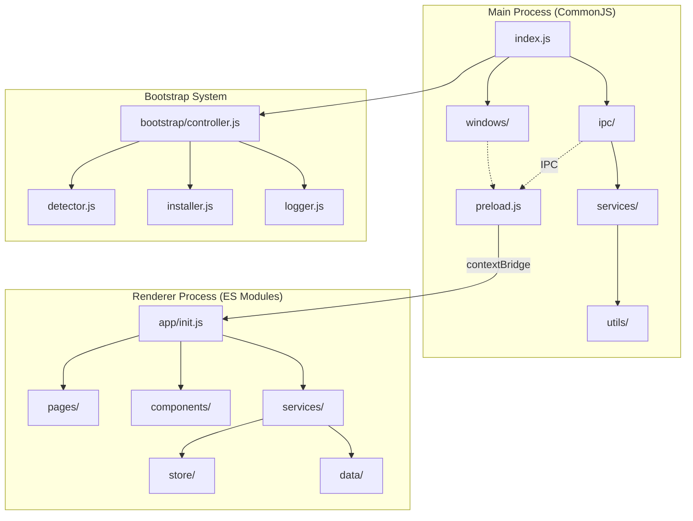
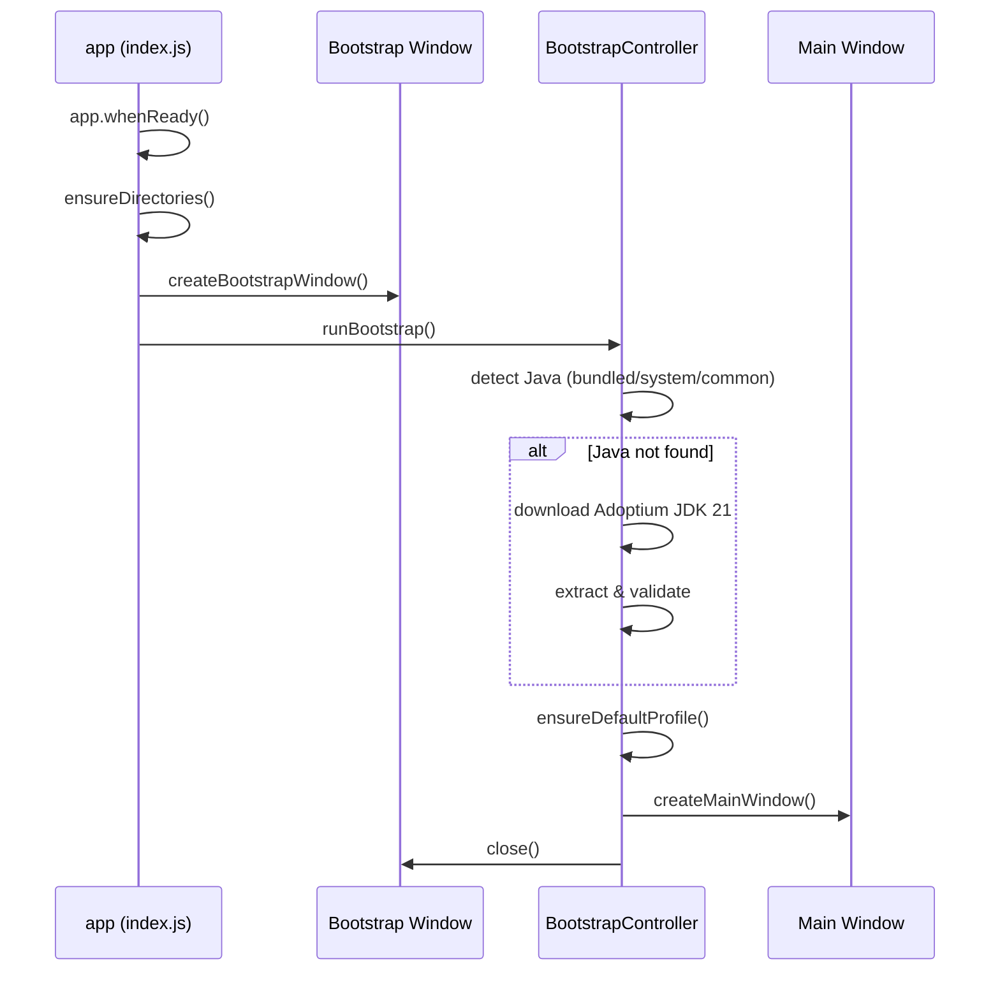
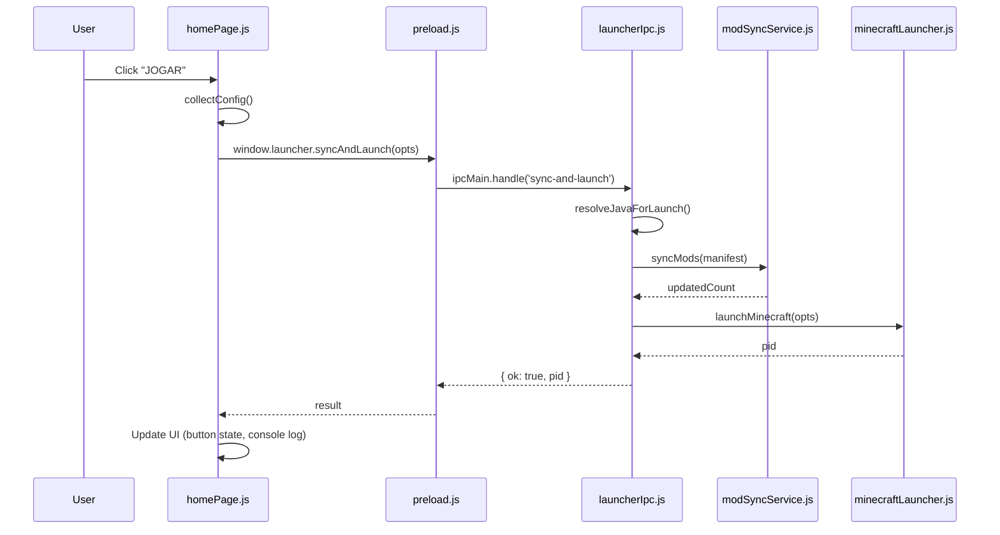

## Introduction

Umucraft Launcher is built on **Electron 28**, combining a Node.js backend (main process) with a modern web-based frontend (renderer process). The architecture follows a **layered modular design** with clear separation of concerns between processes and within each process.

## Architecture Diagram



## Core Principles

### Two-Process Architecture

Electron applications run in two separate processes:

- **Main Process**: Node.js runtime with full system access (file I/O, spawning processes, etc.)
- **Renderer Process**: Chromium-based web environment (HTML/CSS/JavaScript)

Communication between processes happens exclusively through **IPC (Inter-Process Communication)** via Electron's `ipcMain` and `ipcRenderer` APIs.

### Module System Split

The project uses different module systems for each process:

- **Main Process (CommonJS)**: Uses `require()` and `module.exports`
  - Why: Maximum compatibility with Node.js ecosystem and native modules
  - File extension: `.js` with CommonJS syntax
  
- **Renderer Process (ES Modules)**: Uses `import` and `export`
  - Why: Modern JavaScript, tree-shaking, cleaner syntax for UI code
  - File extension: `.js` with ES Module syntax
  - Loaded via `<script type="module">` in HTML

### Security Model

The launcher implements Electron security best practices:

- `nodeIntegration: false` — Renderer cannot directly access Node.js APIs
- `contextIsolation: true` — Preload script runs in isolated context
- `contextBridge` — Exposes only specific, safe APIs to renderer via `window.launcher`

## Directory Structure

```text
src/
├── main/                          # Main process (Node.js backend)
│   ├── index.js                   # Entry point & app lifecycle
│   ├── state.js                   # Shared mutable state
│   ├── preload.js                 # IPC bridge for main window
│   ├── bootstrap-preload.js       # IPC bridge for bootstrap window
│   ├── bootstrap/                 # Java detection & installation system
│   │   ├── controller.js          # State machine orchestration
│   │   ├── detector.js            # Java runtime detection
│   │   ├── installer.js           # Adoptium JDK download & extraction
│   │   └── logger.js              # Bootstrap logging + IPC events
│   ├── ipc/                       # IPC handlers by domain
│   │   ├── windowIpc.js           # Window controls (minimize/maximize/close)
│   │   ├── bootstrapIpc.js        # Bootstrap retry & log access
│   │   ├── configIpc.js           # Config load/save
│   │   ├── launcherIpc.js         # Manifest fetch, sync-and-launch
│   │   ├── serverIpc.js           # Server ping
│   │   └── utilIpc.js             # Utilities (open folder, browse, system info)
│   ├── services/                  # Business logic layer
│   │   ├── profileService.js      # Profile creation + MC client download
│   │   ├── manifestService.js     # Remote manifest fetching
│   │   ├── modSyncService.js      # Mod sync (download zip, verify MD5, extract)
│   │   ├── minecraftLauncher.js   # Java resolution + MC spawn
│   │   ├── forgeInstaller.js      # Forge installation
│   │   └── serverPingService.js   # Minecraft server TCP ping
│   ├── utils/                     # Reusable utilities
│   │   ├── paths.js               # BASE_DIR, constants, directory setup
│   │   ├── ipcSender.js           # send() and log() to renderer
│   │   ├── download.js            # File download with progress
│   │   ├── http.js                # HTTP GET JSON with redirect
│   │   └── fileHash.js            # MD5 hashing
│   └── windows/                   # Window creation
│       ├── mainWindow.js          # Main launcher window (960×640)
│       └── bootstrapWindow.js     # Bootstrap window (520×400)
│
├── renderer/                      # Renderer process (UI)
│   ├── index.html                 # Main window shell with 6 tabs
│   ├── bootstrap.html             # Bootstrap window HTML
│   ├── bootstrap-renderer.js      # Bootstrap window logic
│   ├── helpers.js                 # DOM helpers ($(), logLine(), escapeHtml())
│   ├── app/
│   │   └── init.js                # Application entry point
│   ├── store/
│   │   └── state.js               # Reactive application state
│   ├── data/                      # Static data
│   │   ├── servers.js             # Server list
│   │   ├── tips.js                # Tips & videos
│   │   └── discord.js             # Discord invite
│   ├── services/                  # Frontend services
│   │   ├── configService.js       # Config UI sync (apply/collect)
│   │   ├── manifestClient.js      # Manifest fetch + UI population
│   │   └── ipcBridge.js           # IPC event listeners
│   ├── components/                # Reusable UI components
│   │   ├── titlebar.js            # Custom titlebar (minimize/maximize/close)
│   │   ├── sidebar.js             # Tab navigation
│   │   ├── loadingOverlay.js      # Loading overlay
│   │   └── serverCard.js          # Server card component
│   └── pages/                     # Tab-specific logic
│       ├── homePage.js            # Home: launch, profile, username
│       ├── modsPage.js            # Mods: grid grouped by modpack
│       ├── serversPage.js         # Servers: ping + status display
│       ├── tipsPage.js            # Tips: video grid by category
│       ├── discordPage.js         # Discord: invite button
│       └── settingsPage.js        # Settings: RAM, directory, Java path
```

## Layered Architecture

### Main Process Layers

The main process follows a strict top-down dependency flow:

```text
index.js (entry point, lifecycle)
    ↓
windows/ (window creation)
    ↓
ipc/ (IPC handlers)
    ↓
services/ (business logic)
    ↓
utils/ (low-level utilities)
```

**Layer responsibilities:**

1. **index.js**: App lifecycle (`app.whenReady()`, `app.quit()`), bootstrap orchestration, IPC registration
2. **windows/**: BrowserWindow creation with security settings
3. **ipc/**: IPC handlers that map renderer requests to service calls
4. **services/**: Pure business logic (no IPC dependencies)
5. **utils/**: Reusable utilities (file operations, HTTP, hashing)

### Renderer Process Layers

The renderer follows a component-based architecture:

```text
app/init.js (entry point)
    ↓
pages/ + components/ (UI logic)
    ↓
services/ (IPC + state management)
    ↓
store/ + data/ (state + static data)
```

## Application Lifecycle

### Startup Sequence



### Six Tab Interface

The main window provides six tabs:

1. **Home** (`tab-home`): Profile selector, username input, launch button, news feed, progress console
2. **Mods** (`tab-mods`): Grid of mods grouped by modpack, version display
3. **Servers** (`tab-servers`): Server cards with real-time ping, player count, status indicators
4. **Tips** (`tab-tips`): Video tutorials and tips organized by category
5. **Discord** (`tab-discord`): Discord server invite with link button
6. **Settings** (`tab-settings`): RAM slider, Minecraft directory picker, Java path display

Navigation between tabs is handled by `src/renderer/components/sidebar.js`.

## State Management

### Main Process State

**File**: `src/main/state.js`

Shared mutable object with:

```javascript
{
  mainWindow: BrowserWindow | null,
  bootstrapWindow: BrowserWindow | null,
  bootstrapCtrl: BootstrapController | null,
  resolvedJavaPath: string | null
}
```

Imported by modules that need access to shared state (windows, IPC handlers, services).

### Renderer Process State

**File**: `src/renderer/store/state.js`

```javascript
{
  config: {},              // User config (username, RAM, selectedProfile)
  manifest: null,          // Server manifest (profiles, mods, news)
  sysInfo: {},            // System info (platform, totalRam, launcherDir)
  isLaunching: false      // Launch in progress flag
}
```

This state is mutated by services and read by pages/components.

## Data Flow

### Launch Flow Example



## Key Files

| File | Purpose |
|------|--------|
| `src/main/index.js` | Application entry point, lifecycle management |
| `src/main/preload.js` | IPC bridge exposing `window.launcher.*` methods |
| `src/renderer/app/init.js` | Renderer entry point, component initialization |
| `src/main/bootstrap/controller.js` | Java bootstrap state machine |
| `src/main/services/modSyncService.js` | Mod synchronization logic |
| `src/main/services/minecraftLauncher.js` | Minecraft process spawning |
| `src/renderer/pages/homePage.js` | Launch button logic |
| `src/renderer/services/ipcBridge.js` | IPC event listeners for progress updates |

## Next Steps

- [Main Process Architecture](/architecture/main-process) — Deep dive into the backend
- [Renderer Process Architecture](/architecture/renderer-process) — Frontend structure
- [IPC Communication](/architecture/ipc-communication) — Process communication patterns
